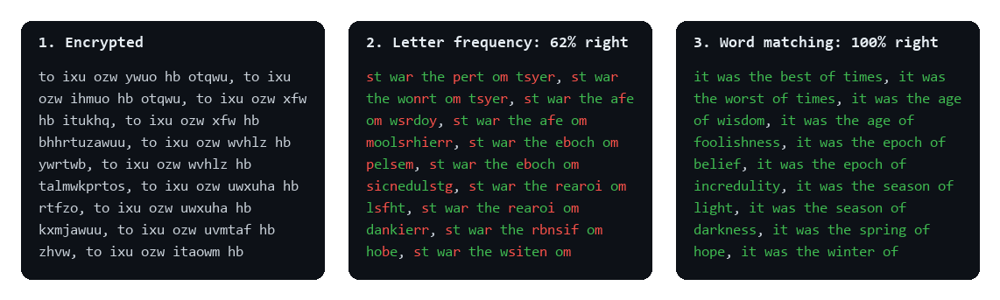

# Cipher Cracker

A Python tool that breaks substitution ciphers by statistical analysis of English. Every letter of a text is secretly swapped for another letter, and the program works out the key without being told anything, using only how often letters and words appear in normal English.



*The opening of* A Tale of Two Cities*, encrypted with a random key and cracked. Green letters are correct and red ones are wrong.*

## How it works

1. **Learn English.** Read a large English text ([`data/english_corpus.txt`](data/english_corpus.txt), *The Adventures of Sherlock Holmes*) and count how often each letter and each word appears.
2. **First guess: letter frequencies.** Rank the letters of the secret text by frequency and match them to English: the most common one is probably `e`, then `t`, and so on. This gets about half of the letters right.
3. **Improve with words.** Try swapping every pair of letters in the key and keep a swap if more of the decrypted words become real English words. Repeat until no swap helps. On a page-long text this recovers the original exactly.

For Caesar ciphers (every letter shifted by the same amount) it simply tries all 26 shifts and keeps the one that produces the most English words.

## How to run

You need Python 3.8 or newer. No extra packages are required.

```bash
git clone https://github.com/idoshalom1997/Cipher-Cracker.git
cd Cipher-Cracker
python crack.py demo
```

The demo encrypts a sample text with a random key and prints the encrypted text, the first guess and the final result, with the share of letters recovered at each step.

Use your own text:

```bash
python crack.py encrypt my_text.txt > secret.txt   # encrypt with a random key
python crack.py crack secret.txt                   # crack it
python crack.py crack secret.txt --caesar          # crack a Caesar (shift) cipher
```

The method needs a decent amount of text, about a page or more. On a few sentences there aren't enough letters for the frequencies to be reliable.

## Code

| File | What's in it |
|---|---|
| [`language_dict.py`](language_dict.py) | Letter and word frequencies of a text, and saving/loading them as text. |
| [`cipher.py`](cipher.py) | `break_ceaser_code`, `break_code` (letter frequencies) and `break_code_with_words` (pair-swapping improvement). |
| [`crack.py`](crack.py) | Command-line tool and demo. |
| [`tests/`](tests) | Unit tests, including full cracks of Caesar and substitution ciphers. |

Run the tests with:

```bash
python -m unittest discover -s tests
```

## Background

Written in January 2022 by **Ido Shalom and Daniel Rodan** as an exercise in *Introduction to Programming* at the Hebrew University of Jerusalem (B.Sc. Statistics & Data Science). The basic encrypt/decrypt helpers at the top of `cipher.py` were provided by the course; the statistics and cracking logic are ours.

The sample texts are public-domain books from [Project Gutenberg](https://www.gutenberg.org/).
